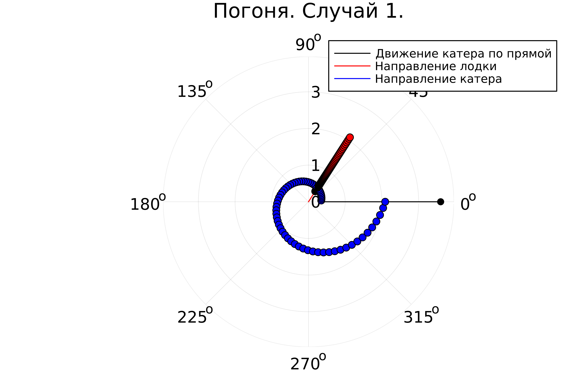
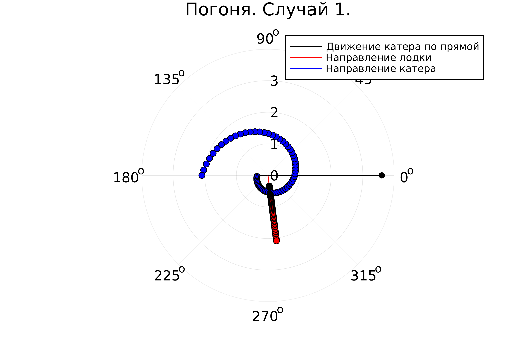

---
## Front matter
title: "Лабораторная работа н.2"
subtitle: "Задач о погоне"
author: "Петров Артем Евгеньевич"

## Generic otions
lang: ru-RU
toc-title: "Содержание"

## Bibliography
bibliography: bib/cite.bib
csl: pandoc/csl/gost-r-7-0-5-2008-numeric.csl

## Pdf output format
toc: true # Table of contents
toc-depth: 2
lof: true # List of figures
lot: true # List of tables
fontsize: 12pt
linestretch: 1.5
papersize: a4
documentclass: scrreprt
## I18n polyglossia
polyglossia-lang:
  name: russian
  options:
	- spelling=modern
	- babelshorthands=true
polyglossia-otherlangs:
  name: english
## I18n babel
babel-lang: russian
babel-otherlangs: english
## Fonts
mainfont: PT Serif
romanfont: PT Serif
sansfont: PT Sans
monofont: PT Mono
mainfontoptions: Ligatures=TeX
romanfontoptions: Ligatures=TeX
sansfontoptions: Ligatures=TeX,Scale=MatchLowercase
monofontoptions: Scale=MatchLowercase,Scale=0.9
## Biblatex
biblatex: true
biblio-style: "gost-numeric"
biblatexoptions:
  - parentracker=true
  - backend=biber
  - hyperref=auto
  - language=auto
  - autolang=other*
  - citestyle=gost-numeric
## Pandoc-crossref LaTeX customization
figureTitle: "Рис."
tableTitle: "Таблица"
listingTitle: "Листинг"
lofTitle: "Список иллюстраций"
lotTitle: "Список таблиц"
lolTitle: "Листинги"
## Misc options
indent: true
header-includes:
  - \usepackage{indentfirst}
  - \usepackage{float} # keep figures where there are in the text
  - \floatplacement{figure}{H} # keep figures where there are in the text
---

# Цель работы

Изучить базовый функционал и синтаксис языка Julia, научиться загружать сторонние библиотеки. Решить задачу о погоне.
Вариант 22. n = 3.6, dist = 9.6

# Задание

На море в тумане катер береговой охраны преследует лодку браконьеров.
Через определенный промежуток времени туман рассеивается, и лодка
обнаруживается на расстоянии 9,6 км от катера. Затем лодка снова скрывается в
тумане и уходит прямолинейно в неизвестном направлении. Известно, что скорость
катера в 3,6 раза больше скорости браконьерской лодки.
  1. Запишите уравнение, описывающее движение катера, с начальными 
условиями для двух случаев (в зависимости от расположения катера 
относительно лодки в начальный момент времени). 
  2. Постройте траекторию движения катера и лодки для двух случаев.
  3. Найдите точку пересечения траектории катера и лодки
# Теоретическое введение

Julia — высокоуровневый свободный язык программирования с динамической типизацией, созданный для математических вычислений. Эффективен также и для написания программ общего назначения. Синтаксис языка схож с синтаксисом других математических языков (например, MATLAB и Octave), однако имеет некоторые существенные отличия. Julia написан на Си, C++ и Scheme. Имеет встроенную поддержку многопоточности и распределённых вычислений, реализованные в том числе в стандартных конструкциях.

Язык является динамическим, при этом поддерживает JIT-компиляцию (JIT-компилятор на основе LLVM входит в стандартный комплект), благодаря чему, по утверждению авторов языка, приложения, полностью написанные на языке (без использование низкоуровневых библиотек и векторных операций) практически не уступают в производительности приложениям, написанным на статически компилируемых языках, таких как Си или C++. Большая часть стандартной библиотеки языка написана на нём же.

Поддерживается перегрузка функций и операторов (которые фактически также являются функциями), при этом опционально можно указывать тип для аргументов функции, чего обычно нет в динамически типизируемых языках. Это позволяет создавать специализированные варианты функций и операторов для ускорения вычислений. Наиболее подходящий вариант функции выбирается автоматически в процессе выполнения. Также благодаря перегрузке операторов можно создавать новые типы данных, которые ведут себя подобно встроенным типам.

# Выполнение лабораторной работы

## 1. Установка Julia
Установим сам язык и необходимые библиотеки с помощью Microsoft Store через командную строку:
```cmd
winget install julia -s msstore
```

## 2. Настройка IDE VSCODE

### Установим необходимые расширения(рис. [-@fig:001])

{#fig:001 width=70%}

### Теперь установим необходимые библиотеки

```Julia
import Pkg
Pkg.add("DifferentialEquations")
```

### Теперь напишем нашу программу

``` Julia
using Plots
using DifferentialEquations

# Начальные условия
const n = 3.6
const dist = 9.6


# Функция траектории катера
function ship(u, p, t)
    return u / sqrt(n*n - 1)
end

# Функция для решения задачи
function task(dist, n, opt)
    # Сначала создаем пустую переменную
    r = 0.0
    Sector = 0.0 
    
    # Теперь в зависимости от переменной opt будет решать одно из двух условий
    if opt == 0
        r = dist/(n+1)
        Sector = (0, 2*pi)
    elseif opt == 1
        r = -(dist/(n+1))
        Sector = (-pi, pi)
    else
        return 
    end

    # Вызываем функцию для создания Дифференциального ур.
    ode = ODEProblem(ship, abs(r), Sector)

    # Решаем наше диф. уравнение
    sol = solve(ode, dtmax = 0.1)

    # Строим пустое полотно
    plt = plot(
        proj=:polar, #Задаем пустое полотно 
        dpi = 500, # Выбираем кол-во точек
        legend = true 
    )

    # @show sol.t
    # @show sol.u

    # Выбираем случайную точку из решения
    r_i = rand(1:size(sol.t)[1])
    # Получаем решение с помощью случайного индекса(или траекторию)
    r_angle = sol.t[r_i]


    # Рисуем основное полотно
    plot!(plt, 
        xlabel = "theta",
        ylabel = "r(t)",
        title = "Погоня",     
    )


    plot!(
        plt, 
        xlabel = "thera",
        ylabel = "r(t)",
        title = "Погоня. Случай " + string(opt),
    )

    savefig(plt, "lab_2_1")

    # Рисуем известные точки и прямую начального движения лодки)
    plot!(
        plt,
        [0.0, 0.0],
        [dist, r],
        label = "Движение катера по прямой",
        color = :black
    )
    scatter!(
        plt, 
        [0.0], 
        [dist],
        label = "",
        mc = :black
    )

    plot!(plt, 
        [r_angle, r_angle], 
        [0.0, sol.u[1]],
        label = "Направление лодки",
        color = :red,
    )
    scatter!(plt, 
        [r_angle],
        [sol.u[1]],
        label = "",
        mc = :red,
    )
        
    plot!(plt, 
        [sol.t[1], sol.t[1]], 
        [sol.u[1], sol.u[1]],
        label = "Направление катера",
        color = :blue,
    )

    savefig(plt, "lab_2_1")

    # Строим траектории движения лодки и катера(после того, как он заметил лодку)
    for i in 2:size(sol.t)[1]
        plot!(
            plt,
            [r_angle, r_angle],
            [sol.u[i-1], sol.u[i]],
            label = "",
            color = :red
        )
        scatter!(
            plt, 
            [r_angle],
            [sol.u[i]],
            label = "",
            mc = :red,
        )

        plot!(
            plt,
            [sol.t[i-1], sol.t[i]],
            [sol.u[i-1], sol.u[i]],
            label = "",
            color = :blue
        )
        scatter!(
            plt, 
            [sol.t[i]],
            [sol.u[i]],
            label = "",
            mc = :blue,
        )
    end

    name = "task_" * string(opt)

    savefig(plt, name)
end

task(n, dist, 0)
task(n, dist, 1)
```

### Ответ

{#fig:002 width=70%}


{#fig:003 width=70%}

# Выводы
На этой лабораторной работе я изучил основной синтаксис Julia, метод решения ОДУ и инструмент визуализации данных в Julia

