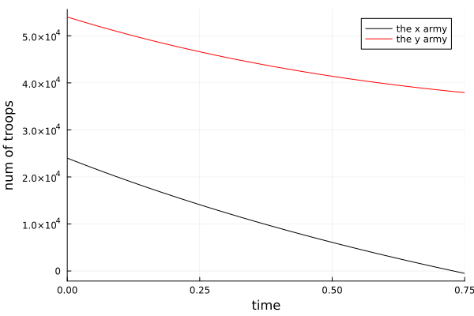

---
## Front matter
lang: ru-RU
title: "Лабораторная работа н.3"
subtitle: "Модель боевых действий. Модель Ланчестера"
author:
  - "Петров Артем Евгеньевич"
institute:
  - Российский университет дружбы народов, Москва, Россия
date: 24 Февраля 2024 

## i18n babel
babel-lang: russian
babel-otherlangs: english

## Formatting pdf
toc: false
toc-title: Содержание
slide_level: 2
aspectratio: 169
section-titles: true
theme: metropolis
header-includes:
 - '\makeatletter'
 - '\makeatother'
---

# Информация

## Докладчик

:::::::::::::: {.columns align=center}
::: {.column width="70%"}

  * Петров Артем Евгеньевич
  * Студент
  * Российский университет дружбы народов
  * [1032219251@rudn.ru](mailto:1032219251@rudn.ru)
  * <https://github.com/wlcmtunknwndth>

:::
::: {.column width="30%"}
:::
::::::::::::::

# Вводная часть

Законы Ланчестера (законы Осипова — Ланчестера) — математическая формула для расчета относительных сил пары сражающихся сторон — подразделений вооруженных сил. В статье «Влияние численности сражающихся сторон на их потери», опубликованной журналом «Военный сборник» в 1915 году, генерал-майор Корпуса военных топографов М. П. Осипов описал математическую модель глобального вооружённого противостояния, практически применяемую в военном деле при описании убыли сражающихся сторон с течением времени и, входящую в математическую теорию исследования операций, на год опередив английского математика Ф. У. Ланчестера. Мировая война, две революции в России не позволили новой власти заявить в установленном в научной среде порядке об открытии царского офицера.

Уравнения Ланчестера — это дифференциальные уравнения, описывающие зависимость между силами сражающихся сторон A и D как функцию от времени, причем функция зависит только от A и D.

В 1916 году, в разгар первой мировой войны, Фредерик Ланчестер разработал систему дифференциальных уравнений для демонстрации соотношения между противостоящими силами. Среди них есть так называемые Линейные законы Ланчестера (первого рода или честного боя, для рукопашного боя или неприцельного огня) и Квадратичные законы Ланчестера (для войн начиная с XX века с применением прицельного огня, дальнобойных орудий, огнестрельного оружия).

## Условия

Фотография задания[рис. 1]

{#fig:001 width=70%}

# Выполнение лабораторной работы

## 1. Подключим необходимые библиотеки

Их мы установили в прошлой лабораторной работе

```Julia
using Plots
using DifferentioalEquations
```

## 2. Решим первую задачу, описав дифференциальное уравнение и воспользовавшись библиотечной функции решения дифференциального уравнения

```Julia
# Начальное соотношение сил
x0 = 24000
y0 = 54000
## Сохраним эти значения в set
vals = (x0, y0)

# Подстановка коэффицентов
a = 0.4 
b = 0.64
c = 0.77
h = 0.3
arg1 = 5 # коэф. при P(x)
arg2 = 5 # коэф. при Q(x)
arg3 = 1 # свободный Коэф. в обоих ур.
# Сохраним все значения в set, чтобы передавать в функцию для решения дифф. ур.
coefs = (a, b, c, h, arg1, arg2, arg3, arg3)

# функция P(x)
function P(t, coef)
    return sin(t) + coef
end

# функция Q(x)
function Q(t, coef)
    return cos(t) + coef
end

# Описание дифф. ур.
function F(du, vals, coefs, t)
    a, b, c, h, arg1, arg2, arg3, arg4 = coefs    
    x, y = vals
    du[1] = -a * x - b * y + P(t, arg1) + arg3
    du[2] = -c * x - h * y + Q(t, arg2) + arg4
end 

# Вызов функции, в которую передаем ординаты ф-ции и абсциссы в виде врем. промежутка 
problem = ODEProblem(F, [x0, y0], [0, 0.75], coefs)

# Решение дифф. ур
sol = solve(problem)

# Построение дифф. ур для первой армии
plt = plot(
    sol, 
    idxs = (0, 1),
    label = "the x army",
    color = :black,
)

# Построение дифф. ур для второй армии
plot!(
    sol,
    idxs = (0, 2),
    label = "the y army",
    color = :red,
    ylabel = "num of troops",
    xlabel = "time"
)

savefig(plt, ".\\lab3\\image\\task1.png")
```

## Решение второй задачи, которая учитвает вклад партизанских войск

- Вторая задача решается аналогично, за исключением добавления дополнительного монома в дифф. ур., но смысл всей логики не меняется

``` Julia
using Plots
using DifferentialEquations

# Task 2

x0 = 24000
y0 = 54000
vals = (x0, y0)

a = 0.35
b = 0.67
c = 0.77
h = 0.45
arg1 = 0
arg2 = 0
arg3 = 2
arg4 = 1
coefs = (a, b, c, h, arg1, arg2, arg3, arg4)

function P(t, coef)
    return sin(t) + coef
end

function Q(t, coef)
    return cos(t) + coef
end

function F(du, vals, coefs, t)
    a, b, c, h, arg1, arg2, arg3, arg4 = coefs    
    x, y = vals
    du[1] = -a * x - b * y + P(t, arg1) + arg3
    du[2] = -c * x * y - h * y + Q(t, arg2) + arg4
end 

problem = ODEProblem(F, [x0, y0], [0, 0.001], coefs)

sol = solve(problem)

plt = plot(
    sol, 
    idxs = (0, 1),
    label = "the x army",
    color = :black,
)

plot!(
    sol,
    idxs = (0, 2),
    label = "the y army",
    color = :red,
    ylabel = "num of troops",
    xlabel = "time",
    title = "Nums of troops and rebels"
)

savefig(plt, ".\\lab3\\image\\task2.png")
```


### Ответ. Вывод программы 

- График первой задачи[рис. 2] 

{#fig:002 width=70%}

- График второй задачи[рис. 2]

{#fig:002 width=70%}

# Выводы

Благодаря данной лабораторной работе я подкрепил свои знания в написании программ на языке Julia, а также решил задачу Ланчестера.