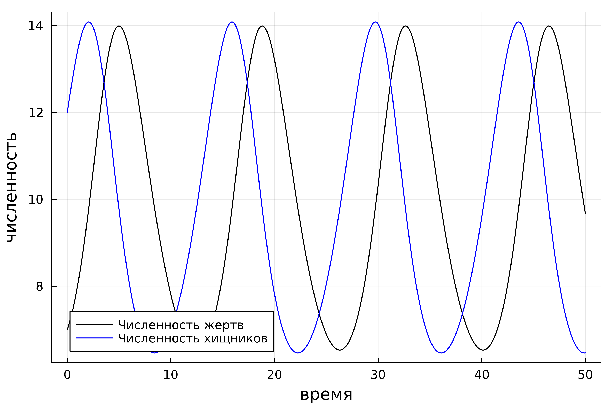

---
## Front matter
lang: ru-RU
title: "Лабораторная работа н.5"
subtitle: "Модель 'Хищник-Жертва'. Модель Лотки-Волтерры."
author:
  - "Петров Артем Евгеньевич"
institute:
  - Российский университет дружбы народов, Москва, Россия
date: 17 Февраля 2024 

## i18n babel
babel-lang: russian
babel-otherlangs: english

## Formatting pdf
toc: false
toc-title: Содержание
slide_level: 2
aspectratio: 169
section-titles: true
theme: metropolis
header-includes:
 - \metroset{progressbar=frametitle,sectionpage=progressbar,numbering=fraction}
 - '\makeatletter'
 - '\beamer@ignorenonframefalse'
 - '\makeatother'
---

# Информация

## Докладчик

:::::::::::::: {.columns align=center}
::: {.column width="70%"}

  * Петров Артем Евгеньевич
  * Студент
  * Российский университет дружбы народов
  * [1032219251@rudn.ru](mailto:1032219251@rudn.ru)
  * <https://github.com/wlcmtunknwndth>

:::
::: {.column width="30%"}
:::
::::::::::::::

# Вводная часть

{#fig:001 width=70%}

## Задание. Вариант 22.

{#fig:002 width=70%}

# Выполнение Лабораторной работы

## 1. Подключим необходимые библиотеки

```Julia
using Plots
using DifferentialEquations
```

## 2. Приступим к написанию самой программы

``` Julia
# Начальные условия
x0 = 7
y0 = 12

# Коэффиценты уравнений
a = 0.45
b = 0.046
c = 0.47
d = 0.048

# Описание функции
function df(du, u, p, t)
    du[1] = -a * u[1] + b * u[1] * u[2]
    du[2] = c * u[2] - d * u[1] * u[2]    
end

# Интервал для вычислений
interval = (0, 50)
# Начальные условия в виде массива
initial = [x0, y0]

problem = ODEProblem(df, initial, interval)

solution = solve(problem, dtmax=0.05)

# Массивы решений по всем итерациям
x_arr = [u[1] for u in solution.u]
y_arr = [u[2] for u in solution.u]
t_arr = [t for t in solution.t]

plt = plot(
    dpi = 600,
    legend = true,
    x_arr,
    y_arr,
    color = :red,
    label = "Зависимости численности хищников от численности жертв",
    xlabel = "жертвы",
    ylabel = "хищники"
)

savefig(plt, "./lab5/image/1_1.png")

plt1 = plot(
    dpi = 600,
)


plot!(
    plt1,
    t_arr,
    x_arr,
    label = "Численность жертв",
    xlabel = "время",
    ylabel = "численность",
    color = :black
)

plot!(
    plt1,
    t_arr,
    y_arr,
    label = "Численность хищников",
    color = :blue    
)

savefig(plt1, "./lab5/image/1_2.png")
```

### Ответ

{#fig:003 width=70%}


{#fig:004 width=70%}

## 3. Найдем стационарное решение системы

В принципе, смысл программы практически не изменится. Стационарное состояние системы достигается при x0 = c/d и y0 = a/b

```Julia
a = 0.45
b = 0.046

c = 0.47
d = 0.048

x0 = c/d
y0 = a/b

function df(du, u, p, t)
    du[1] = -a * u[1] + b * u[1] * u[2]
    du[2] = c * u[2] - d * u[1] * u[2]    
end

interval = (0, 50)

initial = [x0, y0]

problem = ODEProblem(df, initial, interval)

solution = solve(problem, dtmax=0.05)

x_arr = [u[1] for u in solution.u]
y_arr = [u[2] for u in solution.u]
t_arr = [t for t in solution.t]

plt1 = plot(
    dpi = 600,
    legend = true,
    title = "Стационарное состояние хищник-жертва"
)

plot!(
    plt1,
    t_arr,
    x_arr,
    label = "Численность жертв",
    xlabel = "время",
    ylabel = "численность",
    color = :black
)

plot!(
    plt1,
    t_arr,
    y_arr,
    label = "Численность хищников",
    color = :blue    
)

savefig(plt1, "./lab5/image/1_3.png")
```

### Ответ

Получим следующий график(рис. 5)

{#fig:005 width=70%}


В таком случае численность ни одного из видов не уменьшается, чего и следовало ожидать из названия

# Выводы
В ходе выполнения этой лабораторной работы мы познакомились с моделью "Хищник-жертва", воспользовавшись модлью Лотки-Вольтерры

