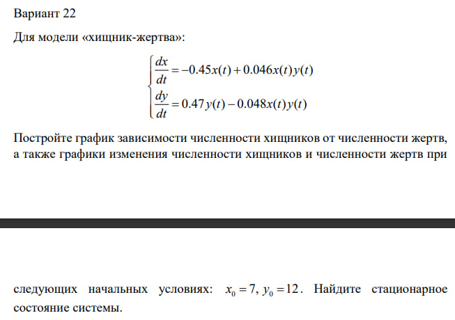
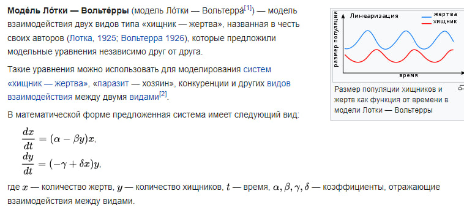
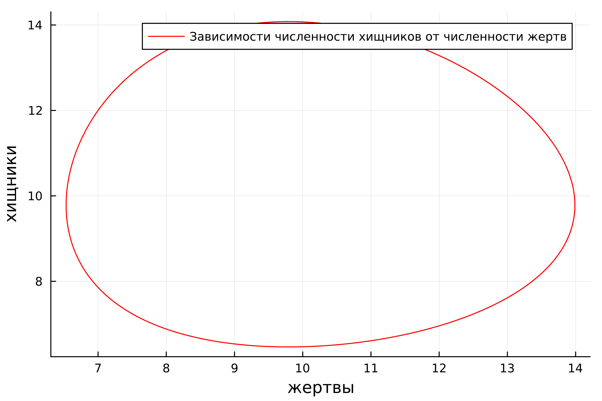
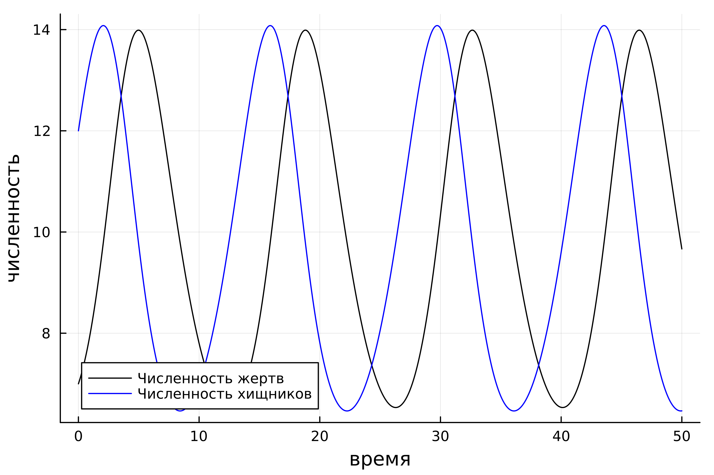
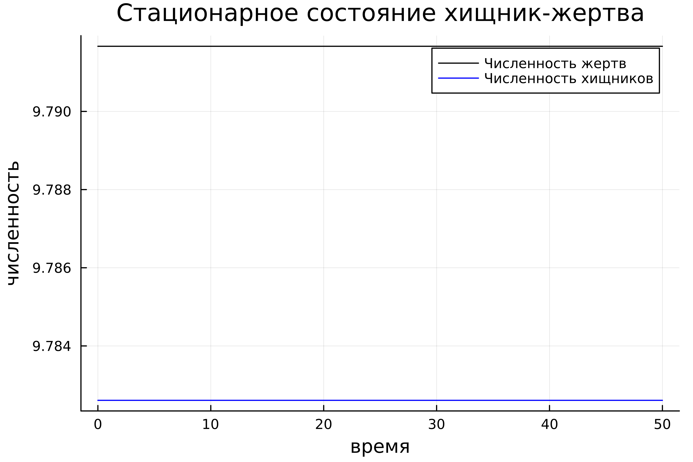

---
## Front matter
title: "Лабораторная работа н.5"
subtitle: "Модель хищник-жертва"
author: "Петров Артем Евгеньевич"

## Generic otions
lang: ru-RU
toc-title: "Содержание"

## Bibliography
bibliography: bib/cite.bib
csl: pandoc/csl/gost-r-7-0-5-2008-numeric.csl

## Pdf output format
toc: true # Table of contents
toc-depth: 2
lof: true # List of figures
lot: true # List of tables
fontsize: 12pt
linestretch: 1.5
papersize: a4
documentclass: scrreprt
## I18n polyglossia
polyglossia-lang:
  name: russian
  options:
	- spelling=modern
	- babelshorthands=true
polyglossia-otherlangs:
  name: english
## I18n babel
babel-lang: russian
babel-otherlangs: english
## Fonts
mainfont: PT Serif
romanfont: PT Serif
sansfont: PT Sans
monofont: PT Mono
mainfontoptions: Ligatures=TeX
romanfontoptions: Ligatures=TeX
sansfontoptions: Ligatures=TeX,Scale=MatchLowercase
monofontoptions: Scale=MatchLowercase,Scale=0.9
## Biblatex
biblatex: true
biblio-style: "gost-numeric"
biblatexoptions:
  - parentracker=true
  - backend=biber
  - hyperref=auto
  - language=auto
  - autolang=other*
  - citestyle=gost-numeric
## Pandoc-crossref LaTeX customization
figureTitle: "Рис."
tableTitle: "Таблица"
listingTitle: "Листинг"
lofTitle: "Список иллюстраций"
lotTitle: "Список таблиц"
lolTitle: "Листинги"
## Misc options
indent: true
header-includes:
  - \usepackage{indentfirst}
  - \usepackage{float} # keep figures where there are in the text
  - \floatplacement{figure}{H} # keep figures where there are in the text
---

# Цель работы

Построить модель взаимодействия двух видов типа "жищних-жертва" -- модель Лотки-Вольтерры

# Задание

{#fig:001 width=70%}

# Теоретическое введение

{#fig:002 width=70%}

# Выполнение лабораторной работы

## 1. Подключим необходимые библиотеки

```Julia
using Plots
using DifferentialEquations
```

## 2. Приступим к написанию самой программы

``` Julia
# Начальные условия
x0 = 7
y0 = 12

# Коэффиценты уравнений
a = 0.45
b = 0.046
c = 0.47
d = 0.048

# Описание функции
function df(du, u, p, t)
    du[1] = -a * u[1] + b * u[1] * u[2]
    du[2] = c * u[2] - d * u[1] * u[2]    
end

# Интервал для вычислений
interval = (0, 50)
# Начальные условия в виде массива
initial = [x0, y0]

problem = ODEProblem(df, initial, interval)

solution = solve(problem, dtmax=0.05)

# Массивы решений по всем итерациям
x_arr = [u[1] for u in solution.u]
y_arr = [u[2] for u in solution.u]
t_arr = [t for t in solution.t]

plt = plot(
    dpi = 600,
    legend = true,
    x_arr,
    y_arr,
    color = :red,
    label = "Зависимости численности хищников от численности жертв",
    xlabel = "жертвы",
    ylabel = "хищники"
)

savefig(plt, "./lab5/image/1_1.png")

plt1 = plot(
    dpi = 600,
)


plot!(
    plt1,
    t_arr,
    x_arr,
    label = "Численность жертв",
    xlabel = "время",
    ylabel = "численность",
    color = :black
)

plot!(
    plt1,
    t_arr,
    y_arr,
    label = "Численность хищников",
    color = :blue    
)

savefig(plt1, "./lab5/image/1_2.png")
```

### Ответ

{#fig:003 width=70%}


{#fig:004 width=70%}

## 3. Найдем стационарное решение системы

В принципе, смысл программы практически не изменится. Стационарное состояние системы достигается при x0 = c/d и y0 = a/b

```Julia
a = 0.45
b = 0.046

c = 0.47
d = 0.048

x0 = c/d
y0 = a/b

function df(du, u, p, t)
    du[1] = -a * u[1] + b * u[1] * u[2]
    du[2] = c * u[2] - d * u[1] * u[2]    
end

interval = (0, 50)

initial = [x0, y0]

problem = ODEProblem(df, initial, interval)

solution = solve(problem, dtmax=0.05)

x_arr = [u[1] for u in solution.u]
y_arr = [u[2] for u in solution.u]
t_arr = [t for t in solution.t]

plt1 = plot(
    dpi = 600,
    legend = true,
    title = "Стационарное состояние хищник-жертва"
)

plot!(
    plt1,
    t_arr,
    x_arr,
    label = "Численность жертв",
    xlabel = "время",
    ylabel = "численность",
    color = :black
)

plot!(
    plt1,
    t_arr,
    y_arr,
    label = "Численность хищников",
    color = :blue    
)

savefig(plt1, "./lab5/image/1_3.png")
```

### Ответ

Получим следующий график(рис. 5)

{#fig:005 width=70%}


В таком случае численность ни одного из видов не уменьшается, чего и следовало ожидать из названия

# Выводы
В ходе выполнения этой лабораторной работы мы познакомились с моделью "Хищник-жертва", воспользовавшись модлью Лотки-Вольтерры

