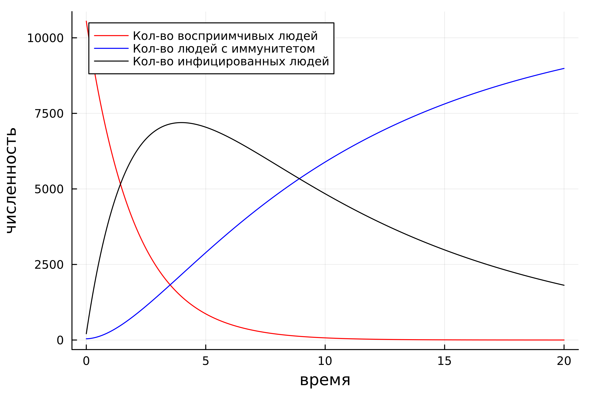

---
## Front matter
title: "Лабораторная работа н.6"
subtitle: "Задача об эпидемии"
author: "Петров Артем Евгеньевич"

## Generic otions
lang: ru-RU
toc-title: "Содержание"

## Bibliography
bibliography: bib/cite.bib
csl: pandoc/csl/gost-r-7-0-5-2008-numeric.csl

## Pdf output format
toc: true # Table of contents
toc-depth: 2
lof: true # List of figures
lot: true # List of tables
fontsize: 12pt
linestretch: 1.5
papersize: a4
documentclass: scrreprt
## I18n polyglossia
polyglossia-lang:
  name: russian
  options:
	- spelling=modern
	- babelshorthands=true
polyglossia-otherlangs:
  name: english
## I18n babel
babel-lang: russian
babel-otherlangs: english
## Fonts
mainfont: PT Serif
romanfont: PT Serif
sansfont: PT Sans
monofont: PT Mono
mainfontoptions: Ligatures=TeX
romanfontoptions: Ligatures=TeX
sansfontoptions: Ligatures=TeX,Scale=MatchLowercase
monofontoptions: Scale=MatchLowercase,Scale=0.9
## Biblatex
biblatex: true
biblio-style: "gost-numeric"
biblatexoptions:
  - parentracker=true
  - backend=biber
  - hyperref=auto
  - language=auto
  - autolang=other*
  - citestyle=gost-numeric
## Pandoc-crossref LaTeX customization
figureTitle: "Рис."
tableTitle: "Таблица"
listingTitle: "Листинг"
lofTitle: "Список иллюстраций"
lotTitle: "Список таблиц"
lolTitle: "Листинги"
## Misc options
indent: true
header-includes:
  - \usepackage{indentfirst}
  - \usepackage{float} # keep figures where there are in the text
  - \floatplacement{figure}{H} # keep figures where there are in the text
---

# Цель работы

Рассмотреть задачу об эпидемии и решить ее с помощью языка программирования Julia

# Задание

На одном острове вспыхнула эпидемия. Известно, что из всех проживающих 
на острове (N=10 800) в момент начала эпидемии (t=0) число заболевших людей 
(являющихся распространителями инфекции) I(0)=208, А число здоровых людей с 
иммунитетом к болезни R(0)=41. Таким образом, число людей восприимчивых к 
болезни, но пока здоровых, в начальный момент времени S(0)=N-I(0)- R(0).
Постройте графики изменения числа особей в каждой из трех групп. 
Рассмотрите, как будет протекать эпидемия в случае: 
1. Если I(0) <= I*
2. Если I(0) > I*

# Теоретическое введение(рис. 1)

{#fig:001 width=70%}

# Выполнение лабораторной работы

## 1. Подключение необходимых библиотек

Подключим необходимые библиотеки:

```Julia
using Plots
using DifferentialEquations
```

## 2. Выполнение лабораторной для случая I(0) <= I*

### Код программы: 

```Julia
N = 10800
I0 = 208
R0 = 41
S0 = N - R0 - I0
aplha = 0.5
beta = 0.1


# u = [S0, I0, R0]
function ode(du, u, p, t)
    du[1] = 0
    du[2] = -beta * u[2]
    du[3] = beta * u[2]
end

u0 = [S0, I0, R0]
t_arr = (0, 20)

prob = ODEProblem(ode, u0, t_arr)
sol = solve(prob, dtmax = 0.05)

S = [u[1] for u in sol.u]
I = [u[2] for u in sol.u]
R = [u[3] for u in sol.u]
T = [t for t in sol.t]

plt = plot(
    dpi = 500,
    legend = true,
    xlabel = "время",
    ylabel = "численность"
)

plot!(
    plt,
    T,
    S,
    label = "Кол-во восприимчивых людей",
    color = :red
)

plot!(
    plt, 
    T,
    R,
    label = "Кол-во людей с иммунитетом",
    color = :blue
)

plot!(
    plt, 
    T,
    I,
    label = "Кол-во инфицированных людей",
    color = :black
)

savefig(plt, "./lab6/image/1.png")
```

### График

В итоге, получим вот такой график(рис. 2): 

{#fig:002 width=70%}

## Выполнение лабораторной работы для случая I(0) > I*

### Код программы для построения графика заболеваемости

```Julia
N = 10800
I0 = 208
R0 = 41
S0 = N - R0 - I0
alpha = 0.5
beta = 0.1


# u = [S0, I0, R0]
function ode(du, u, p, t)
    du[1] = -alpha*u[1]
    du[2] = alpha*u[1] - beta * u[2]
    du[3] = beta * u[2]
end

u0 = [S0, I0, R0]
t_arr = (0, 20)

prob = ODEProblem(ode, u0, t_arr)
sol = solve(prob, dtmax = 0.05)

S = [u[1] for u in sol.u]
I = [u[2] for u in sol.u]
R = [u[3] for u in sol.u]
T = [t for t in sol.t]

plt = plot(
    dpi = 500,
    legend = true,
    xlabel = "время",
    ylabel = "численность"
)

plot!(
    plt,
    T,
    S,
    label = "Кол-во восприимчивых людей",
    color = :red
)

plot!(
    plt, 
    T,
    R,
    label = "Кол-во людей с иммунитетом",
    color = :blue
)

plot!(
    plt, 
    T,
    I,
    label = "Кол-во инфицированных людей",
    color = :black
)

savefig(plt, "./lab6/image/2.png")
```

### График заболеваемости для I(0) > I*

В итоге, получим вот такой график(рис. 3): 

{#fig:003 width=70%}

# Выводы

В этой лабораторной работе мы изучили задачу эпидемии для двух случаев: с изолированными заболевшими и с не изолированными заболевшими. Кроме того, мы укрепили свои знания языка Julia

