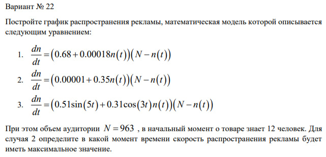
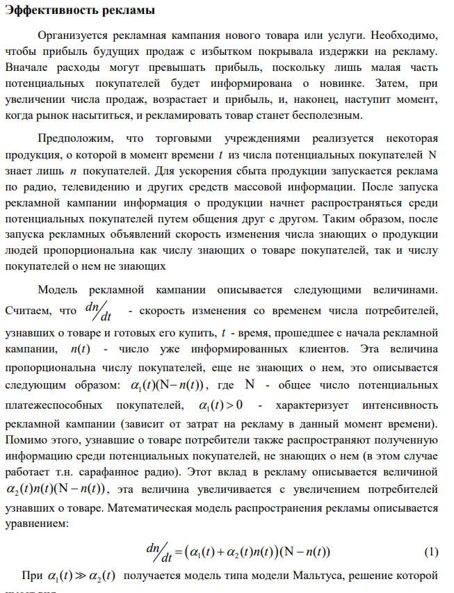
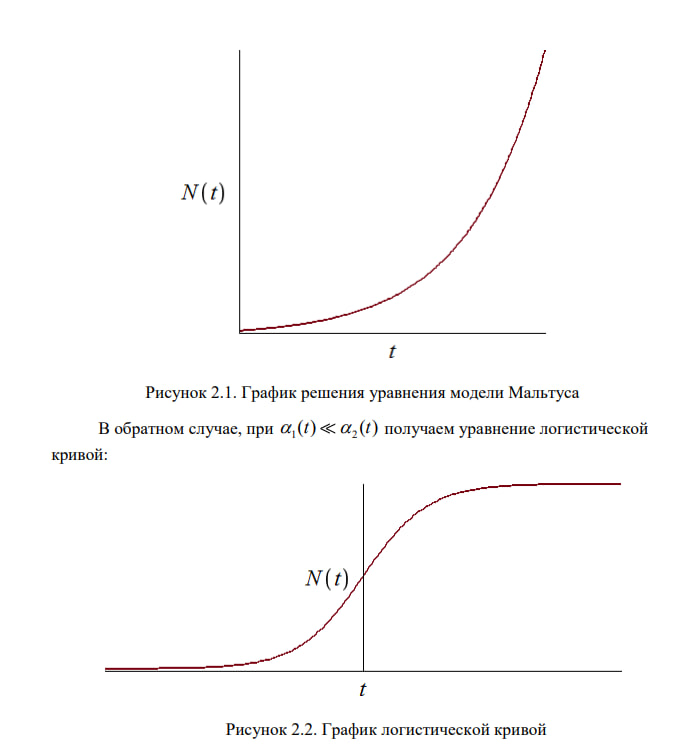
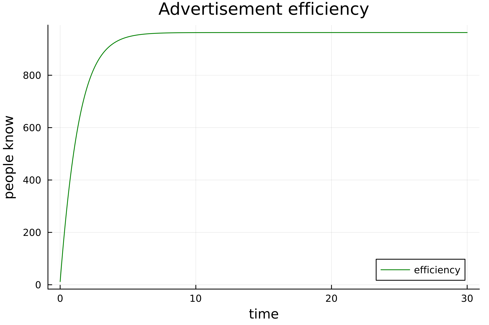
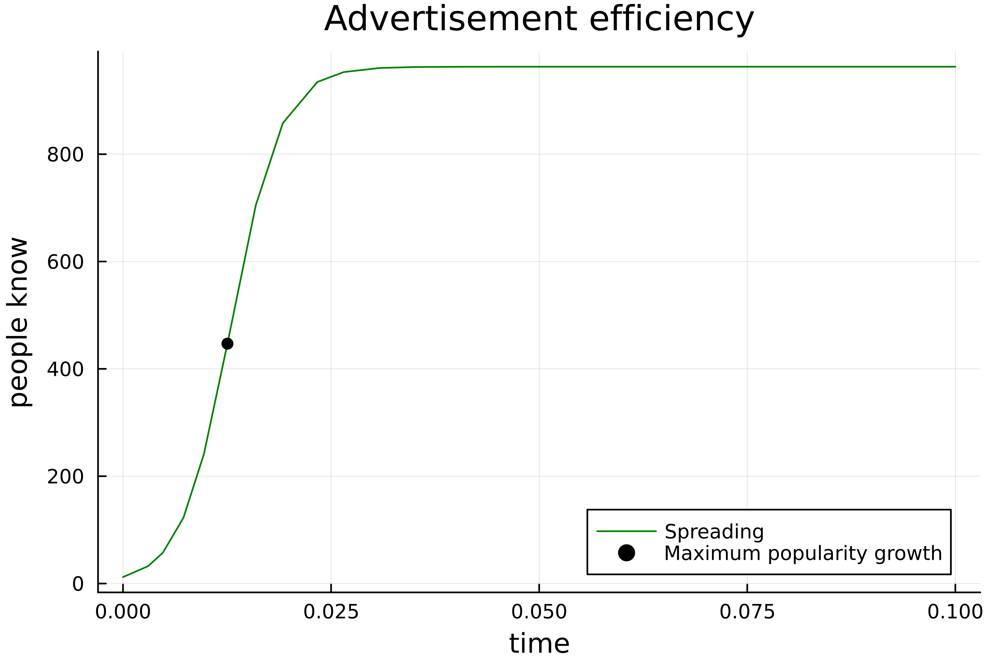
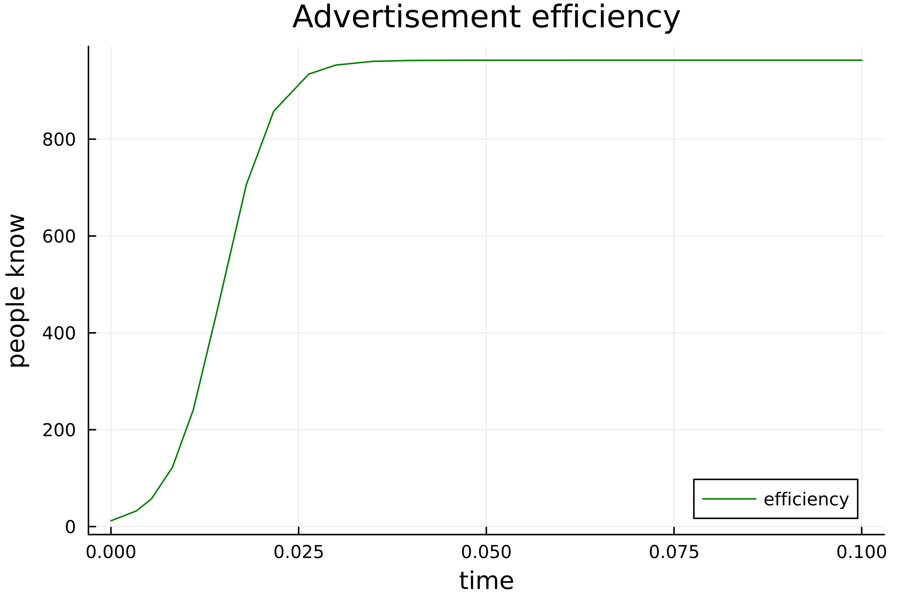

---
## Front matter
lang: ru-RU
title: "Лабораторная работа н.7"
subtitle: "Задач эффективности рекламы"
author:
  - "Петров Артем Евгеньевич"
institute:
  - Российский университет дружбы народов, Москва, Россия
date: 23 Марта 2024 

## i18n babel
babel-lang: russian
babel-otherlangs: english

## Formatting pdf
toc: false
toc-title: Содержание
slide_level: 2
aspectratio: 169
section-titles: true
theme: metropolis
header-includes:
 - \metroset{progressbar=frametitle,sectionpage=progressbar,numbering=fraction}
 - '\makeatletter'
 - '\beamer@ignorenonframefalse'
 - '\makeatother'
---

# Информация

## Докладчик

:::::::::::::: {.columns align=center}
::: {.column width="70%"}

  * Петров Артем Евгеньевич
  * Студент
  * Российский университет дружбы народов
  * [1032219251@rudn.ru](mailto:1032219251@rudn.ru)
  * <https://github.com/wlcmtunknwndth>

:::
::: {.column width="30%"}
:::
::::::::::::::

# Задание

{#fig:001 width=70%}


# Теоретическое введение(рис. 1)

{#fig:002 width=70%}

{#fig:003 width=70%}


# Выполнение лабораторной работы

## 1. Подключение необходимых библиотек

Подключим необходимые библиотеки:

```Julia
using Plots
using DifferentialEquations
```

## 2. Выполнение лабораторной для задачи 1.

### Код программы: 

```Julia
N = 963
n0 = 12


alpha = 0.68
beta = 0.00018

function ode(du, u, p, t)
    du[1] = (alpha + beta*u[1]) * (N - u[1])
    
end

t_arr = (0, 30)
problem = ODEProblem(ode, [n0], t_arr)

solution = solve(problem, dtmax = 0.05)

n = [u[1] for u in solution.u]
T = [t for t in solution.t]

plt = plot(
    dpi = 500, 
    title = "Advertisement efficiency",
    xlabel = "time",
    ylabel = "people know",
    legend = true
)

plot!(
    plt,
    T,
    n,
    label = "efficiency",
    color = :green
)

savefig(plt, "./lab7/image/lab7_1.png")
```

### График эффективности рекламы для задачи 1.

В итоге, получим вот такой график(рис. 1): 

{#fig:001 width=70%}

## 3. Выполнение лабораторной для задачи 2.

### Код программы: 

```Julia
N = 963
n0 = 12

alpha = 0.00001
beta = 0.35

function ode(du, u, p, t)
    du[1] = (alpha + beta * u[1]) * (N - u[1])
end

t_arr = (0, 0.1)
problem = ODEProblem(ode, [n0], t_arr)
solution = solve(problem, dtmax = 0.01)

n = [u[1] for u in solution.u]
T = [t for t in solution.t]


function findmax_dn(T, sol)
    max_dn = 0
    max_t = 0
    max_n = 0

    for (i, t) in enumerate(T)
        if sol(t, Val{1})[1] > max_dn
            max_dn = sol(t, Val{1})[1]
            max_t = t
            max_n = n[i]
        end
    end
    return max_dn, max_t, max_n
end    

max_dn, max_t, max_n = findmax_dn(T, solution)

plt = plot(
    dpi = 500, 
    title = "Advertisement efficiency",
    xlabel = "time",
    ylabel = "people know",
    legend = true
)

plot!(
    plt,
    T,
    n,
    label = "Spreading",
    color = :green
)

plot!(
    plt,
    [max_t],
    [max_n],
    seriestype = :scatter,
    label = "Maximum popularity growth",
    color = :black
)

savefig(plt, "./lab7/image/lab7_2.png")

```

### График эффективности рекламы для задачи 2.

В итоге, получим вот такой график(рис. 2): 

{#fig:002 width=70%}

## 4. Выполнение лабораторной для задачи 3.

### Код программы: 

```Julia
N = 963
n0 = 12


alpha = 0.51
beta = 0.31

function ode(du, u, p, t)
    du[1] = (alpha*sin(5*t) + beta*cos(3*t)*u[1]) * (N - u[1])
    
end

t_arr = (0, 0.1)
problem = ODEProblem(ode, [n0], t_arr)

solution = solve(problem, dtmax = 0.01)

n = [u[1] for u in solution.u]
T = [t for t in solution.t]

plt = plot(
    dpi = 500, 
    title = "Advertisement efficiency",
    xlabel = "time",
    ylabel = "people know",
    legend = true
)

plot!(
    plt,
    T,
    n,
    label = "efficiency",
    color = :green
)

savefig(plt, "./lab7/image/lab7_3.png")
```

### График эффективности рекламы для задачи 3.

В итоге, получим вот такой график(рис. 3): 

{#fig:003 width=70%}


# Выводы

В этой лабораторной работе мы изучили задачу об эффективности рекламы и подкрепили свои знания языка Julia и его библиотек.
