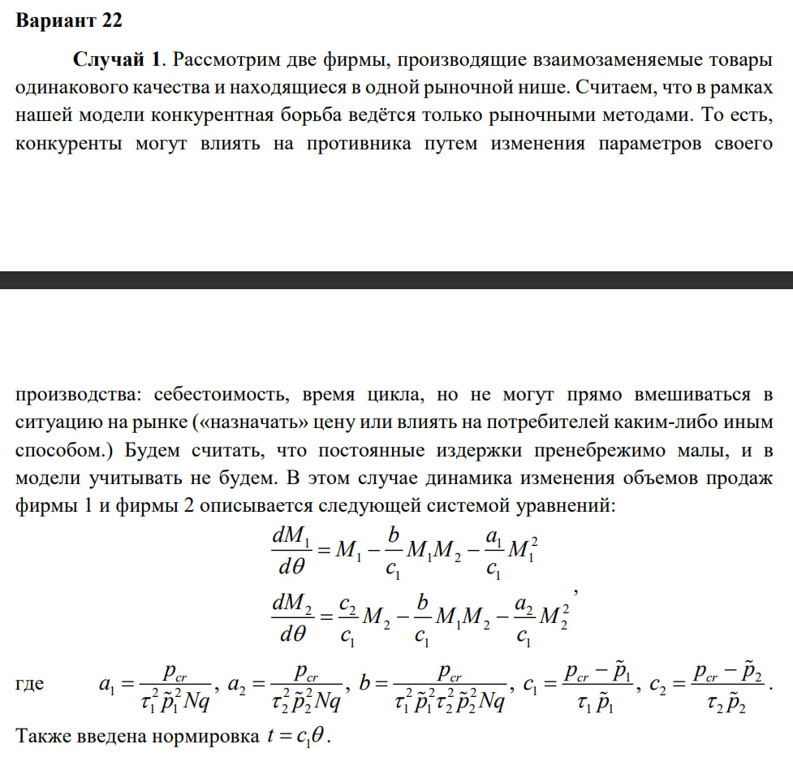
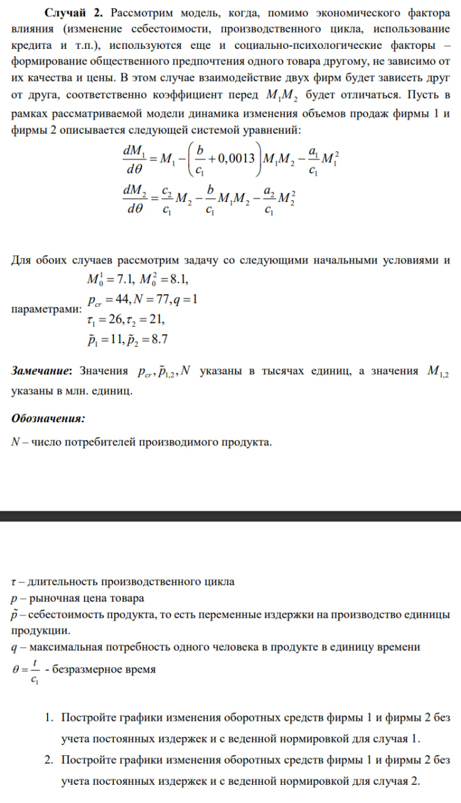
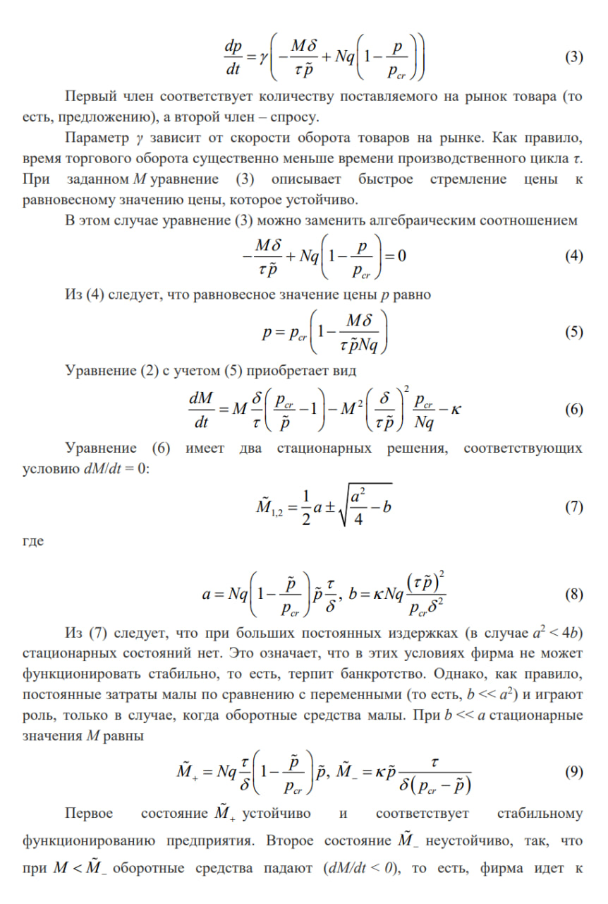
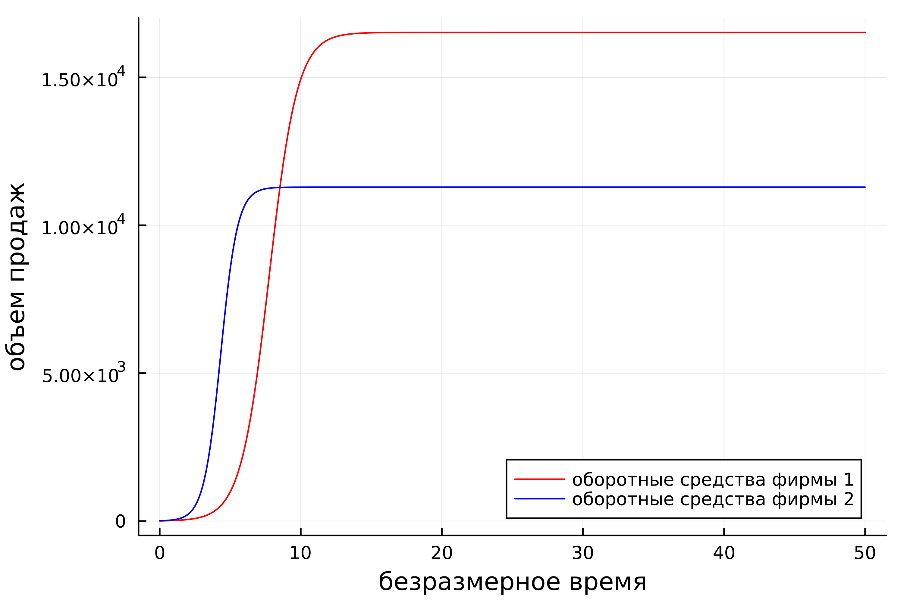
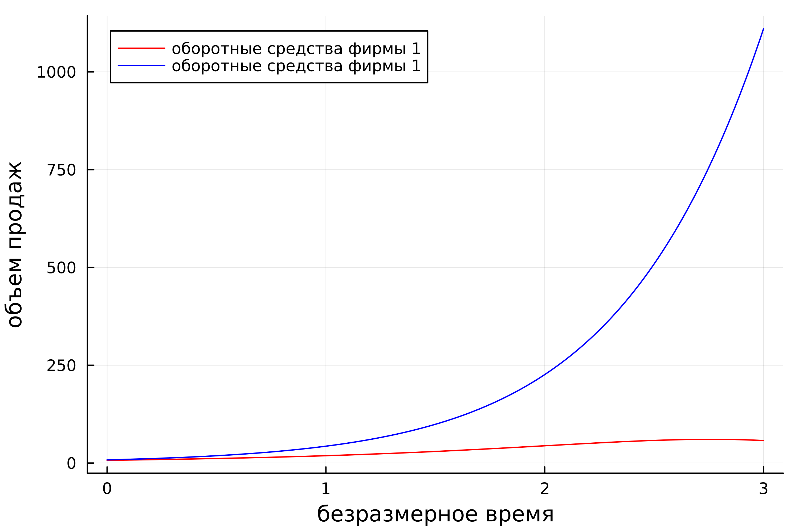

---
## Front matter
lang: ru-RU
title: "Лабораторная работа н.8"
subtitle: "Модель конкурентности двух фирм"
author:
  - "Петров Артем Евгеньевич"
institute:
  - Российский университет дружбы народов, Москва, Россия
date: 30 Марта 2024

## i18n babel
babel-lang: russian
babel-otherlangs: english

## Formatting pdf
toc: false
toc-title: Содержание
slide_level: 2
aspectratio: 169
section-titles: true
theme: metropolis
header-includes:
 - \metroset{progressbar=frametitle,sectionpage=progressbar,numbering=fraction}
 - '\makeatletter'
 - '\beamer@ignorenonframefalse'
 - '\makeatother'
---

# Информация

## Докладчик

:::::::::::::: {.columns align=center}
::: {.column width="70%"}

  * Петров Артем Евгеньевич
  * Студент
  * Российский университет дружбы народов
  * [1032219251@rudn.ru](mailto:1032219251@rudn.ru)
  * <https://github.com/wlcmtunknwndth>

:::
::: {.column width="30%"}
:::
::::::::::::::

# Задание

{#fig:001 width=70%}

{#fig:002 width=70%}

# Теоретическое введение(рис. 1)

{#fig:003 width=70%}

{#fig:004 width=70%}

{#fig:005 width=70%}

{#fig:006 width=70%}


# Выполнение лабораторной работы

## 1. Подключение необходимых библиотек

Подключим необходимые библиотеки:

```Julia
using Plots
using DifferentialEquations
```
## 2. Выполнение лабораторной для случая 1.

### Код программы: 

```Julia
M1 = 7.1
M2 = 8.1
p_cr = 44
N = 77
q = 1
tau1 = 26
tau2=21
p1= 11
p2 = 8.7

a1 = p_cr / (tau1^2 * p1^2 * N * q)
a2 = p_cr / (tau2^2 * p2^2 * N * q)
b = p_cr / (tau1^2 * tau2^2 * p1^2 * p2^2 * N * q)
c1 = (p_cr - p1) / (tau1 * p1)
c2 = (p_cr - p2) / (tau2 * p2)

function ode(du, u, p, t)
    du[1] = u[1] - b/c1*u[1] * u[2] - a1/c1*u[1]^2
    du[2] = c2/c1*u[2] - b / c1 * u[1] * u[2] - a2 / c1*u[2]^2
end

t_arr = (0, 50)
prob = ODEProblem(ode, [M1, M2], t_arr)
sol = solve(prob, dtmax = 0.05)

ans1 = [u[1] for u in sol.u]
ans2 = [u[2] for u in sol.u]
t = [t for t in sol.t]

plt = plot(
    dpi = 500,
    legend = true,
    xlabel = "безразмерное время",
    ylabel = "объем продаж"
)

plot!(
    plt, 
    t,
    ans1,
    label = "оборотные средства фирмы 1",
    color = :red
)

plot!(
    plt,
    t,
    ans2,
    label = "оборотные средства фирмы 2",
    color = :blue
)

savefig(plt, "./lab8/image/lab8_1.png")

```

### График для случая 1.

В итоге, получим вот такой график(рис. 1): 

{#fig:007 width=70%}

## 3. Выполнение лабораторной для случая 2.

### Код программы: 

```Julia
M1 = 7.1
M2 = 8.1
p_cr = 44
N = 77
q = 1
tau1 = 26
tau2=21
p1= 11
p2 = 8.7

a1 = p_cr / (tau1^2 * p1^2 * N * q)
a2 = p_cr / (tau2^2 * p2^2 * N * q)
b = p_cr / (tau1^2 * tau2^2 * p1^2 * p2^2 * N * q)
c1 = (p_cr - p1) / (tau1 * p1)
c2 = (p_cr - p2) / (tau2 * p2)

function ode(du, u, p, t)
    du[1] = u[1] - (b/c1+0.0013)*u[1] * u[2] - a1/c1*u[1]^2
    du[2] = c2/c1*u[2] - b / c1 * u[1] * u[2] - a2 / c1*u[2]^2
end

t_arr = (0, 3)
prob = ODEProblem(ode, [M1, M2], t_arr)
sol = solve(prob, dtmax = 0.01)

ans1 = [u[1] for u in sol.u]
ans2 = [u[2] for u in sol.u]
t = [t for t in sol.t]

plt = plot(
    dpi = 500,
    legend = true,
    xlabel = "безразмерное время",
    ylabel = "объем продаж"
)

plot!(
    plt, 
    t,
    ans1,
    label = "оборотные средства фирмы 1",
    color = :red
)

plot!(
    plt,
    t,
    ans2,
    label = "оборотные средства фирмы 2",
    color = :blue
)

savefig(plt, "./lab8/image/lab8_2.png")
```

### График для случая 2.

В итоге, получим вот такой график(рис. 2): 

{#fig:008 width=70%}

# Выводы

В этой лабораторной работе мы изучили задачу об эффективности рекламы и подкрепили свои знания языка Julia и его библиотек.
