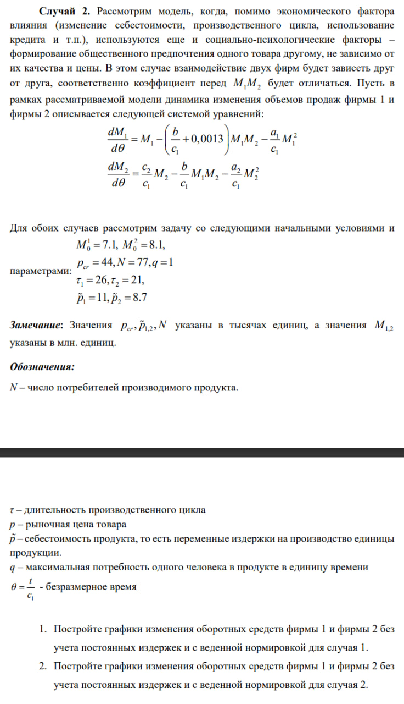
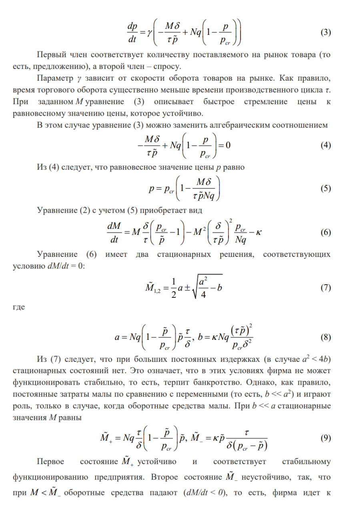

---
## Front matter
title: "Лабораторная работа н.8"
subtitle: "Модель конкуренции двух фирм"
author: "Петров Артем Евгеньевич"

## Generic otions
lang: ru-RU
toc-title: "Содержание"

## Bibliography
bibliography: bib/cite.bib
csl: pandoc/csl/gost-r-7-0-5-2008-numeric.csl

## Pdf output format
toc: true # Table of contents
toc-depth: 2
lof: true # List of figures
lot: true # List of tables
fontsize: 12pt
linestretch: 1.5
papersize: a4
documentclass: scrreprt
## I18n polyglossia
polyglossia-lang:
  name: russian
  options:
	- spelling=modern
	- babelshorthands=true
polyglossia-otherlangs:
  name: english
## I18n babel
babel-lang: russian
babel-otherlangs: english
## Fonts
mainfont: PT Serif
romanfont: PT Serif
sansfont: PT Sans
monofont: PT Mono
mainfontoptions: Ligatures=TeX
romanfontoptions: Ligatures=TeX
sansfontoptions: Ligatures=TeX,Scale=MatchLowercase
monofontoptions: Scale=MatchLowercase,Scale=0.9
## Biblatex
biblatex: true
biblio-style: "gost-numeric"
biblatexoptions:
  - parentracker=true
  - backend=biber
  - hyperref=auto
  - language=auto
  - autolang=other*
  - citestyle=gost-numeric
## Pandoc-crossref LaTeX customization
figureTitle: "Рис."
tableTitle: "Таблица"
listingTitle: "Листинг"
lofTitle: "Список иллюстраций"
lotTitle: "Список таблиц"
lolTitle: "Листинги"
## Misc options
indent: true
header-includes:
  - \usepackage{indentfirst}
  - \usepackage{float} # keep figures where there are in the text
  - \floatplacement{figure}{H} # keep figures where there are in the text
---

# Цель работы

Рассмотреть задачу об конкуренции двух фирм и решить ее с помощью языка программирования Julia

# Задание

{#fig:001 width=70%}

{#fig:002 width=70%}


# Теоретическое введение(рис. 1)

{#fig:003 width=70%}

{#fig:004 width=70%}

{#fig:005 width=70%}

{#fig:006 width=70%}

# Выполнение лабораторной работы

## 1. Подключение необходимых библиотек

Подключим необходимые библиотеки:

```Julia
using Plots
using DifferentialEquations
```

## 2. Выполнение лабораторной для случая 1.

### Код программы: 

```Julia
M1 = 7.1
M2 = 8.1
p_cr = 44
N = 77
q = 1
tau1 = 26
tau2=21
p1= 11
p2 = 8.7

a1 = p_cr / (tau1^2 * p1^2 * N * q)
a2 = p_cr / (tau2^2 * p2^2 * N * q)
b = p_cr / (tau1^2 * tau2^2 * p1^2 * p2^2 * N * q)
c1 = (p_cr - p1) / (tau1 * p1)
c2 = (p_cr - p2) / (tau2 * p2)

function ode(du, u, p, t)
    du[1] = u[1] - b/c1*u[1] * u[2] - a1/c1*u[1]^2
    du[2] = c2/c1*u[2] - b / c1 * u[1] * u[2] - a2 / c1*u[2]^2
end

t_arr = (0, 50)
prob = ODEProblem(ode, [M1, M2], t_arr)
sol = solve(prob, dtmax = 0.05)

ans1 = [u[1] for u in sol.u]
ans2 = [u[2] for u in sol.u]
t = [t for t in sol.t]

plt = plot(
    dpi = 500,
    legend = true,
    xlabel = "безразмерное время",
    ylabel = "объем продаж"
)

plot!(
    plt, 
    t,
    ans1,
    label = "оборотные средства фирмы 1",
    color = :red
)

plot!(
    plt,
    t,
    ans2,
    label = "оборотные средства фирмы 2",
    color = :blue
)

savefig(plt, "./lab8/image/lab8_1.png")

```

### График для случая 1.

В итоге, получим вот такой график(рис. 1): 

{#fig:007 width=70%}

## 3. Выполнение лабораторной для случая 2.

### Код программы: 

```Julia
M1 = 7.1
M2 = 8.1
p_cr = 44
N = 77
q = 1
tau1 = 26
tau2=21
p1= 11
p2 = 8.7

a1 = p_cr / (tau1^2 * p1^2 * N * q)
a2 = p_cr / (tau2^2 * p2^2 * N * q)
b = p_cr / (tau1^2 * tau2^2 * p1^2 * p2^2 * N * q)
c1 = (p_cr - p1) / (tau1 * p1)
c2 = (p_cr - p2) / (tau2 * p2)

function ode(du, u, p, t)
    du[1] = u[1] - (b/c1+0.0013)*u[1] * u[2] - a1/c1*u[1]^2
    du[2] = c2/c1*u[2] - b / c1 * u[1] * u[2] - a2 / c1*u[2]^2
end

t_arr = (0, 3)
prob = ODEProblem(ode, [M1, M2], t_arr)
sol = solve(prob, dtmax = 0.01)

ans1 = [u[1] for u in sol.u]
ans2 = [u[2] for u in sol.u]
t = [t for t in sol.t]

plt = plot(
    dpi = 500,
    legend = true,
    xlabel = "безразмерное время",
    ylabel = "объем продаж"
)

plot!(
    plt, 
    t,
    ans1,
    label = "оборотные средства фирмы 1",
    color = :red
)

plot!(
    plt,
    t,
    ans2,
    label = "оборотные средства фирмы 2",
    color = :blue
)

savefig(plt, "./lab8/image/lab8_2.png")
```

### График для случая 2.

В итоге, получим вот такой график(рис. 2): 

{#fig:008 width=70%}


# Выводы

В этой лабораторной работе мы изучили задачу о конкуренции двух фирм и подкрепили свои знания языка Julia и его библиотек.
